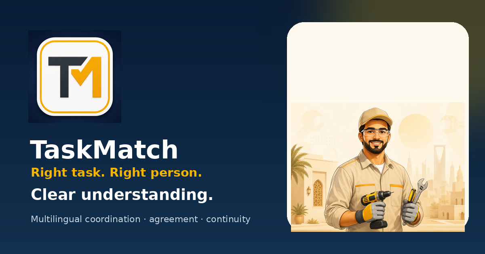

<div align="center">

# TaskMatch

### Right task. Right person. **Clear understanding.**

**A multilingual, voice-forward local-services marketplace with a coordination layer around the match.**

<br>

<kbd>UNDER DEVELOPMENT</kbd>
&nbsp;
<kbd>FOUNDER-LED</kbd>
&nbsp;
<kbd>SAUDI-FIRST → GCC</kbd>
&nbsp;
<kbd>REALTIME POC VALIDATED</kbd>

<br><br>

[**🌐 Live Product Showcase**](https://alimulhaqkhan-prog.github.io/taskmatch-product-demo/)
&nbsp;&nbsp;•&nbsp;&nbsp;
[**📱 Try TaskMatch**](https://alimulhaqkhan-prog.github.io/taskmatch-product-demo/app-demo.html)
&nbsp;&nbsp;•&nbsp;&nbsp;
[**⚡ Realtime Technical Proof**](https://alimulhaqkhan-prog.github.io/taskmatch-realtime-test/)

<br><br>



</div>

---

## The thesis

Finding the right worker is only the beginning.

A local-service transaction can still fail **after the match** because of language differences, script differences, unclear negotiation, changing scope, materials, transport costs, arrival timing, and terms that disappear inside ordinary chat history.

TaskMatch is being developed around an additional idea:

> **The marketplace should not only find the match. It should help both sides keep the same understanding of the task as it changes.**

```text
             DISCOVERY / MATCHING
                    │
                    ▼
        ┌─────────────────────────┐
        │      CLIENT ↔ WORKER    │
        │ multilingual discussion │
        └────────────┬────────────┘
                     │
                     ▼
        ┌─────────────────────────┐
        │       TASK BM STATE     │
        │ proposed · pending      │
        │ agreed · changed        │
        │ conflict · confirmed    │
        └────────────┬────────────┘
                     │
              ambiguity / drift
                     │
                     ▼
        ┌─────────────────────────┐
        │   COORDINATION LAYER    │
        │ clarify · suggest       │
        │ verify · preserve state │
        └─────────────────────────┘
```

---

## What TaskMatch is building differently

| Layer | TaskMatch direction |
|---|---|
| 🌐 **Multilingual communication** | Client and worker can communicate in their own language; language and script are separate preferences. |
| 🔤 **Translation ≠ transliteration** | Native script and Roman-script presentation are treated as different operations. |
| 💬 **Private TaskMatch AI Adviser** | Private, task-aware help for meaning, replies, unresolved issues, materials and document/image review. It never auto-sends to the client. |
| 🤝 **Contextual agreement** | Agreement controls appear when relevant instead of permanently cluttering discussion. |
| 🧠 **Task BM continuity** | Keeps an evolving record of what was proposed, accepted, still pending, later changed or conflicted. |
| 🛡️ **Human-confirmed authority** | AI can assist interpretation, but accepted task state changes only through explicit human confirmation. |

---

## Product journey

```text
Nearby Tasks
     ↓
Task Details
     ↓
Discussion
     ↓
Contextual Agreement
     ↓
Both Sides Confirm
     ↓
Task BM / Protected Task Record
```

### Agreement-state language

| State | Meaning |
|---|---|
| 🟢 **Agreed** | Both sides are aligned |
| 🟠 **Required / pending** | Needs clarification or confirmation |
| 🔴 **Conflict / change** | A term has changed or understanding differs |
| ⚪ **Optional / N/A** | Not required for this task |

---

## What works today

| Capability | Status |
|---|---|
| Android / HTML product UI | ✅ Existing |
| Authenticated Client + Worker backend POC | ✅ Validated |
| Persistent task messaging | ✅ Validated |
| Supabase realtime phone-to-phone delivery | ✅ Validated |
| Task BM + `TM-Continuity-1.1` | ✅ Implemented in current prototype |
| Separate client / worker term states | ✅ Implemented in current prototype |
| Ask → Verify → Update correction logic | ✅ Implemented in current prototype |
| `TM-CIE-1.1` bounded intervention heuristic | ✅ Implemented in current prototype |
| Production server-side Qwen multilingual layer | ◐ Next milestone |
| Broader AURA / TM–BM / research-Z / ACI translation | ◌ Research direction |
| Controlled Saudi pilot | ◌ Planned |

> **Important:** the validated realtime result is a **technical proof-of-concept**, not customer traction.

---

## Working realtime proof

TaskMatch has already been tested with:

- separate authenticated **Client** and **Worker** accounts;
- the **same shared task**;
- persistent message history;
- live delivery from one physical phone to another;
- no manual refresh required for the receiving phone.

**Demo seed:** `Bathroom Leak · Plumbing · 300 SAR · Arabic · Riyadh test area`

### [→ Open the two-device realtime technical proof](https://alimulhaqkhan-prog.github.io/taskmatch-realtime-test/)

---

## The durable layer

### **Models can change. The task history should not.**

TaskMatch is not intended to delegate its entire intelligence to one general-purpose AI API.

A model can translate, summarize, explain or suggest a reply. The application can change models or providers over time. But the product also maintains its own task-specific continuity around those model calls.

```text
MODEL / PROVIDER
      │
      │ assists
      ▼
translation · summary · suggestions
      │
      ▼
┌─────────────────────────────────┐
│     TASKMATCH DURABLE LAYER     │
│                                 │
│  multilingual interaction      │
│  bilateral agreement state     │
│  accepted Task BM              │
│  revisions / corrections       │
│  unresolved commitments        │
│  human confirmations           │
└─────────────────────────────────┘
```

The intended durable value is therefore not one model alone, but the **interaction context + bilateral task state + correction history + human-confirmed continuity** accumulated around real work.

---

## Research logic actually present in the current prototype

The current V1.0 HTML source contains a **TaskMatch Continuity & Intervention Engine (`TM-CIE-1.1`)**.

It is a product-engineering heuristic informed by continuity and **Ask → Verify → Update** ideas. It is **not** presented as proof that TaskMatch measures a scientific latent state.

<details>
<summary><strong>1 · Task BM + TM-Continuity-1.1</strong></summary>

<br>

The continuity ledger tracks required task fields across revisions, including:

- labour;
- transport;
- materials;
- arrival;
- separate client and worker states.

Supported term states include:

`unknown · proposed · accepted · rejected · changed`

The ledger also keeps continuity checkpoints and recent corrections.

</details>

<details>
<summary><strong>2 · Bilateral understanding gap M</strong></summary>

<br>

A proposal or acceptance by one side is never treated as mutual agreement.

TaskMatch separately represents the client and worker understanding of the same revision and can detect a bilateral acknowledgement gap.

</details>

<details>
<summary><strong>3 · Ask → Verify → Update</strong></summary>

<br>

When ambiguity, unresolved commitments, contradiction or bilateral misunderstanding becomes meaningful, the product logic can request clarification rather than silently guessing or overwriting accepted Task BM.

</details>

<details>
<summary><strong>4 · Implemented bounded intervention score</strong></summary>

<br>

```text
Z_TM(t) =
sigmoid(
  1.10A
+ 1.50C
+ 1.40D
+ 0.90U
+ 2.50S
+ 1.20M
- 0.95
)
```

Where:

| Signal | Meaning |
|---|---|
| `A` | ambiguity |
| `C` | contradiction |
| `D` | drift from accepted Task BM |
| `U` | unresolved required commitment |
| `S` | safety / policy concern |
| `M` | bilateral understanding / acknowledgement gap |

The resulting engineering score is used to choose among staying silent, offering a private suggestion, requesting clarification, or triggering stronger safety review.

**Boundary:** `Z_TM` is a TaskMatch product-engineering intervention score. It is **not** a claim that the app measures or validates the founder's broader research latent variable `Z`.

</details>

---

## Founder research → future product intelligence

The founder's broader research programme includes work around:

- **AURA / memory-conditioned continuity**
- **TM–BM resonance**
- **functional-status Z**
- **broader ACI-related contextual inference**

These are relevant to future questions such as persistent task-state modelling, context gating, meaningful change detection and correction-aware intervention.

```text
RESEARCH DIRECTION
        ↓
task continuity
        ↓
ambiguity / change detection
        ↓
context-aware intervention
        ↓
human verification
        ↓
updated task state
```

These concepts are presented as **research directions**, not as claims that every research formula is already implemented, patented, scientifically proven, commercially validated or accepted for publication.

---

## Multilingual product direction

TaskMatch treats these as different product problems:

```text
LANGUAGE
   ├── Arabic
   ├── Urdu
   ├── Pashto
   ├── English
   └── ...

SCRIPT / PRESENTATION
   ├── Native Arabic
   ├── Native Urdu
   ├── Roman Urdu
   ├── Native Pashto
   ├── Roman Pashto
   └── ...
```

Translation changes the **language**.

Transliteration changes the **script representation**.

TaskMatch is designed so important task values — such as price, time, quantity and agreed terms — are not casually altered during that transformation.

---

## Saudi-first market direction

TaskMatch is being designed for a **Saudi-first pilot and market-entry model**, followed by wider GCC expansion after the core transaction workflow is validated.

The market thesis does not depend on an invented headline statistic:

> Where clients and workers may use different languages, scripts and negotiation conventions, **communication and coordination quality becomes part of the marketplace product itself.**

No unverified TAM / SAM / SOM figures are used in this repository.

---

## Near-term path

```text
NOW
 │
 ├─ ✅ product UI / interaction prototype
 ├─ ✅ authenticated realtime technical POC
 ├─ ✅ task-state / intervention logic in prototype
 │
 ▼
NEXT
 │
 ├─ server-side multilingual Qwen layer
 ├─ privacy + security hardening
 ├─ Task BM / agreement validation
 ├─ controlled Saudi pilot
 └─ market-entry learning
```

---

## Technology direction

```text
Mobile / Android
      │
      ├── Supabase Auth
      ├── Postgres
      ├── Realtime
      │
      ├── TaskMatch continuity layer
      │
      └── server-side multilingual AI
              └── Qwen integration: next milestone
```

This public repository intentionally contains **no Supabase secret, provider API key, test password, signing key, keystore password or private production configuration**.

---

## Founder

### **Alim ul haq Khan**

Founder · independent researcher · product builder

Working across AI/cognitive-system research, Android product development and applied backend experimentation. TaskMatch connects that research direction to a practical multilingual marketplace and coordination problem.

---

## Contact

| Channel | Contact |
|---|---|
| ✉️ **Email** | **info@alimai.online** |
| 🟢 **WhatsApp** | **+92 340 8185786** |

---

<div align="center">

### Explore TaskMatch

[**Product Showcase**](https://alimulhaqkhan-prog.github.io/taskmatch-product-demo/)
&nbsp;&nbsp;•&nbsp;&nbsp;
[**Interactive App Demo**](https://alimulhaqkhan-prog.github.io/taskmatch-product-demo/app-demo.html)
&nbsp;&nbsp;•&nbsp;&nbsp;
[**Realtime Technical Proof**](https://alimulhaqkhan-prog.github.io/taskmatch-realtime-test/)

<br>

**TaskMatch is under development.**  
This repository is a public product showcase and interactive browser demo — not a production service or a claim of commercial traction.

<br>

`Right task. Right person. Clear understanding.`

</div>
